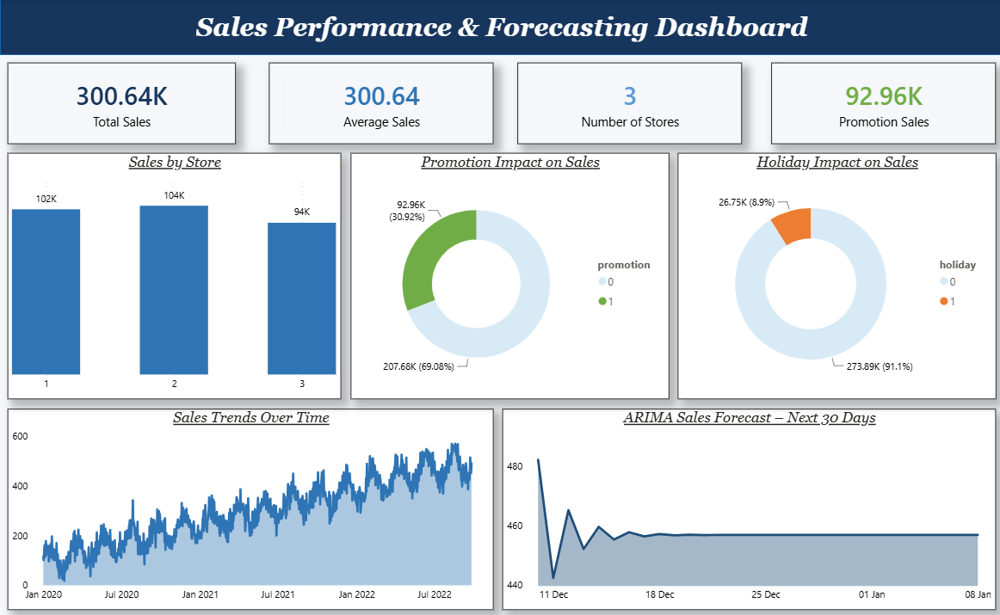

# 📈 Sales Forecasting Dashboard (ARIMA Time Series Analysis)

## 📌 Project Overview

The Sales Forecasting Dashboard is an interactive Business Intelligence solution built using **Power BI, Python (ARIMA), Power Query, and DAX**. 
The project analyzes **1,000 days of daily sales data** across **3 retail stores** to identify sales trends and patterns, forecast future revenue, 
and evaluate the impact of promotions and holidays on sales performance.

---

# 🎯 Problem Statement

ABC Retail Ltd. operates a chain of three stores, each catering to a different demographic. The company has been experiencing unpredictable fluctuations in sales,
leading to frequent stock shortages or excess inventory, and lacks a structured approach to sales forecasting and promotional planning.

This dashboard provides an interactive platform to analyze:

- Sales Trends Over Time
- Store-wise Sales Performance
- Promotion Impact on Sales
- Holiday Impact on Sales
- 30-Day Forward Sales Forecast (ARIMA)

---

# 📂 Dataset Information

| Attribute | Details |
| --------- | ------- |
| Dataset | ABC Retail Daily Sales Data |
| Time Period | 1,000 days |
| Stores | 3 |
| Key Variables | Daily sales revenue, store ID, promotional activity, holiday indicator, weekday |
| File Type | CSV / Power BI Data Model |

---

# 🛠 Technologies Used

- Power BI Desktop
- Python (ARIMA)
- Power Query
- DAX

---

# 🔄 Project Workflow

### Step 1

Collected **1,000 days of historical daily sales data** across 3 stores, including sales revenue, promotional activity, holidays, and weekday indicators.

### Step 2

Performed **Exploratory Data Analysis (EDA)** to identify outliers, missing values, data inconsistencies, and irregular spikes or dips in sales.

### Step 3

Analyzed **sales trends and patterns** across daily, weekly, and monthly periods and evaluated the impact of holidays and promotional activities on sales performance.

### Step 4

Built and validated an **ARIMA time series forecasting model** in Python to generate a **30-day forward sales forecast**, with the predictions stored in a `forecast_results` table.

### Step 5

Imported the historical sales data and forecast output into **Power BI Desktop** and used **Power Query** for data transformation and modeling, including the Date Table, Measure Table, `sales_forecasting_data`, and `forecast_results`.

### Step 6

Created **DAX measures** including Total Sales, Average Sales, Promotion Sales, and Number of Stores to support interactive business analysis.

### Step 7

Developed an interactive **Power BI dashboard** with KPI cards, sales trend visualizations, store comparisons, promotion and holiday analysis, and a 30-day forecast view.

### Step 8

Published the completed report to **Power BI Service** for stakeholder access and interactive reporting.

---

# 📈 Dashboard Contents

## 📄 Sales Forecast Overview

Dashboard includes:

- **KPI Cards:** Total Sales, Average Sales, Number of Stores, Promotion Sales
- **Sales Trends Over Time** — Line chart showing total sales by date
- **ARIMA Sales Forecast – Next 30 Days** — Line chart showing predicted sales from the forecasting model
- **Sales by Store** — Clustered column chart comparing store performance
- **Promotion Impact on Sales** — Donut chart comparing sales during promotional and non-promotional periods
- **Holiday Impact on Sales** — Donut chart comparing sales during holiday and non-holiday periods

---

---

# 📸 Dashboard Preview

## 📄 Sales Forecasting Dashboard

*Interactive Power BI dashboard showing sales trends, store performance, promotion and holiday impact, and 30-day ARIMA sales forecast.*

---

# 📊 Dashboard Metrics

The dashboard provides analysis of:

- Total Sales
- Average Sales
- Promotion Sales
- Number of Stores
- 30-Day Forecasted Sales (ARIMA)

---

# 📉 Key Insights

- Sales patterns vary across **weekdays and holiday periods**, indicating that calendar-related factors influence daily sales performance.
- Promotional periods show a **measurable difference in sales performance** compared with non-promotional periods.
- Holiday periods influence daily sales volume, with the impact varying across stores.
- Store-level performance varies across the three locations, indicating differences in sales and demand patterns.
- The **ARIMA model generates a 30-day forward sales forecast**, providing a data-driven basis for inventory and promotional planning.

---

# ✨ Features

- 30-Day ARIMA Sales Forecast
- Interactive KPI Cards
- Store-wise Sales Comparison
- Promotion & Holiday Impact Analysis
- Historical Sales Trend Analysis
- Dynamic DAX Measures
- Power Query Data Transformation
- Multiple Chart Types
- Interactive Power BI Dashboard

---

# 📚 Skills Demonstrated

- Time Series Analysis & Forecasting (ARIMA)
- Exploratory Data Analysis (EDA)
- Data Cleaning & Transformation
- Power Query
- Data Modeling
- DAX
- Power BI Dashboard Development
- Data Visualization
- Business & Revenue Analysis

---

# 📌 Conclusion

This project demonstrates an end-to-end sales forecasting workflow — from raw daily sales data through EDA, trend analysis, ARIMA-based time series forecasting, 
Power Query transformation, DAX calculations, and interactive Power BI dashboard development.

It showcases how ABC Retail Ltd. can move from reactive, intuition-based decision-making toward a proactive, data-driven approach for inventory planning, 
promotional strategy, store performance analysis, and revenue forecasting.
